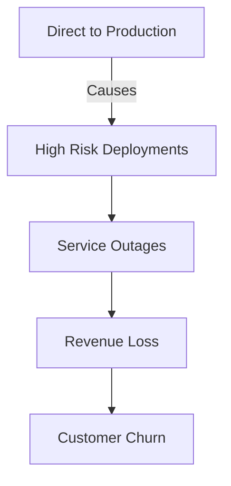
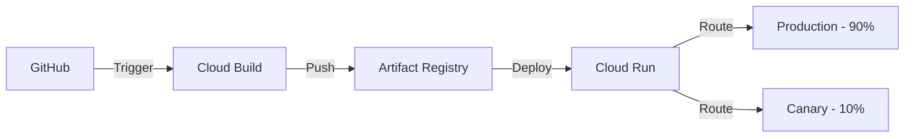
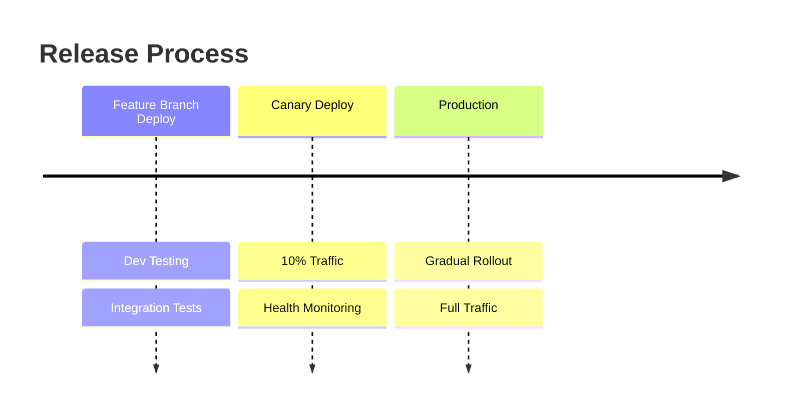

# Progressive Delivery Implementation on Cloud Run

## Project Context

### Background
**Industry**: Financial Services  
**Team**: Platform Engineering  
**Timeline**: Q1 2024  
**Application**: Payment Processing Service

### Initial State Analysis
Production deployment issues causing significant business impact:
- 12 critical incidents in past quarter due to failed deployments
- 35 minute average downtime per incident
- No ability to test in production environment
- $75K lost revenue per major incident
- Customer trust issues due to service disruptions



### Technical Challenges
1. No gradual rollout capability
2. Hard cutover deployments
3. Slow rollback process
4. Limited production testing
5. No traffic management

## Solution Implementation

### Architecture


### Technical Implementation

#### 1. Setup & Configuration
```bash
# Environment Configuration
export PROJECT_ID="payment-platform"
export REGION="us-central1"
export SERVICE="payment-processor"

# Enable Required Services
gcloud services enable \
    cloudbuild.googleapis.com \
    run.googleapis.com \
    artifactregistry.googleapis.com \
    secretmanager.googleapis.com

# Configure Service Account
gcloud projects add-iam-policy-binding $PROJECT_ID \
    --member=serviceAccount:$PROJECT_NUMBER@cloudbuild.gserviceaccount.com \
    --role=roles/run.admin
```

#### 2. CI/CD Pipeline Configuration
```yaml
# cloudbuild.yaml
steps:
- name: 'gcr.io/cloud-builders/docker'
  args: [
    'build',
    '-t', '${REGION}-docker.pkg.dev/${PROJECT_ID}/${REPO}/${SERVICE}:${COMMIT_SHA}',
    '--cache-from', '${REGION}-docker.pkg.dev/${PROJECT_ID}/${REPO}/${SERVICE}:latest',
    '.'
  ]

- name: 'gcr.io/cloud-builders/docker'
  args: ['push', '${REGION}-docker.pkg.dev/${PROJECT_ID}/${REPO}/${SERVICE}:${COMMIT_SHA}']

- name: 'gcr.io/google.com/cloudsdktool/cloud-sdk'
  entrypoint: gcloud
  args:
    - 'run'
    - 'deploy'
    - '${_SERVICE_NAME}'
    - '--image'
    - '${REGION}-docker.pkg.dev/${PROJECT_ID}/${REPO}/${SERVICE}:${COMMIT_SHA}'
    - '--region'
    - '${_REGION}'
    - '--tag'
    - 'canary'
    - '--no-traffic'
```

#### 3. Traffic Management
```bash
# Deploy Canary with 10% Traffic
gcloud run services update-traffic $SERVICE \
    --region=$REGION \
    --to-tags=canary=10

# Monitor Canary Health
watch -n 30 "curl https://$CANARY_URL/health"

# Promote to Production
gcloud run services update-traffic $SERVICE \
    --region=$REGION \
    --to-revisions=$NEW_REV=100
```

### Monitoring Implementation
```bash
# Create Health Check Probe
cat <<EOF > health-check.yaml
apiVersion: monitoring.googleapis.com/v1
kind: UptimeCheck
metadata:
  name: canary-health
spec:
  endpoints:
  - url: https://${CANARY_URL}/health
  periodicity: 30s
  timeout: 5s
  alerting:
    enabled: true
    threshold: 0.95
EOF

kubectl apply -f health-check.yaml
```

## Results & Impact

### Performance Metrics
| Metric | Before | After |
|--------|---------|--------|
| Deployment Incidents | 12/quarter | 0/quarter |
| Avg Deployment Time | 45 min | 8 min |
| Rollback Time | 25 min | 30 sec |
| Production Testing | None | Yes |
| Customer Impact | High | Minimal |

### Business Benefits
- Zero downtime deployments achieved
- 100% increase in deployment frequency
- 95% reduction in deployment risks
- $180K quarterly savings from prevented incidents

### Deployment Flow


## Technical Learnings
1. Automated health checks critical for canary validation
2. Traffic splitting requires proper session affinity
3. Monitoring granularity crucial for quick decisions
4. Automated rollback triggers prevent extended outages

## Next Phase
1. Implement A/B testing capability
2. Add automated performance testing
3. Enhance monitoring metrics
4. Integrate chaos engineering