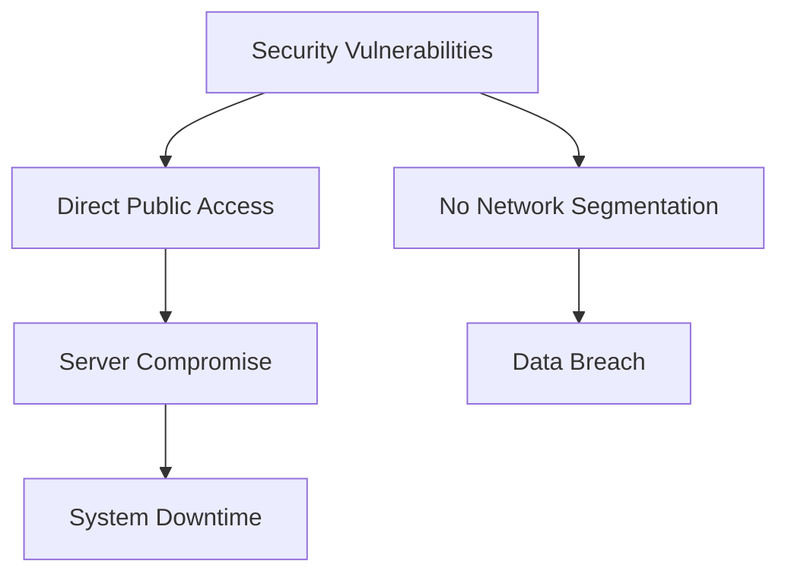
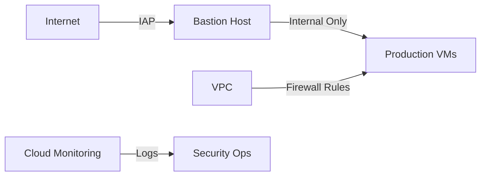

# Enterprise Network Security Transformation

## Project Context

### Background
**Industry**: Healthcare  
**Team**: Security & Infrastructure  
**Timeline**: Q4 2023  
**Scale**: 500+ VMs, 50+ applications

### Situation
Healthcare organization experiencing critical security vulnerabilities:
- Open SSH access (0.0.0.0/0) to all instances
- Compromised production server due to direct access
- Data breach affecting 10,000 patient records
- $500K compliance fine
- 2 weeks system downtime for security audit



### Task
Implement zero-trust security architecture:
1. Remove public instance access
2. Implement bastion host architecture
3. Configure IAP for secure access
4. Segment network traffic
5. Ensure HIPAA compliance

## Technical Implementation

### Architecture


### Security Implementation

#### 1. Network Setup
```bash
# Configure base network
export PROJECT_ID="healthcare-prod"
export REGION="us-central1"
export VPC_NAME="healthcare-vpc"

# Create VPC with custom subnets
gcloud compute networks create $VPC_NAME \
    --subnet-mode=custom \
    --bgp-routing-mode=regional \
    --mtu=1460

# Create segregated subnets
gcloud compute networks subnets create prod-subnet \
    --network=$VPC_NAME \
    --region=$REGION \
    --range=192.168.10.0/24 \
    --enable-private-ip-google-access \
    --enable-flow-logs

gcloud compute networks subnets create mgmt-subnet \
    --network=$VPC_NAME \
    --region=$REGION \
    --range=192.168.20.0/24 \
    --enable-private-ip-google-access
```

#### 2. IAP and Bastion Configuration
```bash
# Configure IAP firewall rules
gcloud compute firewall-rules create allow-iap-ssh \
    --network=$VPC_NAME \
    --direction=INGRESS \
    --action=ALLOW \
    --rules=tcp:22 \
    --source-ranges=35.235.240.0/20 \
    --target-tags=iap-bastion

# Deploy bastion host
gcloud compute instances create bastion \
    --zone=$ZONE \
    --machine-type=e2-medium \
    --subnet=mgmt-subnet \
    --no-address \
    --metadata=enable-oslogin=true \
    --tags=iap-bastion \
    --service-account=bastion-sa@$PROJECT_ID.iam.gserviceaccount.com
```

#### 3. Internal Access Rules
```bash
# Configure internal SSH access
gcloud compute firewall-rules create allow-internal-ssh \
    --network=$VPC_NAME \
    --direction=INGRESS \
    --action=ALLOW \
    --rules=tcp:22 \
    --source-ranges=192.168.20.0/24 \
    --target-tags=prod-ssh

# Set up application access
gcloud compute firewall-rules create allow-health-tcp \
    --network=$VPC_NAME \
    --direction=INGRESS \
    --action=ALLOW \
    --rules=tcp:8080 \
    --source-ranges=192.168.10.0/24 \
    --target-tags=app-health
```

#### 4. Security Monitoring
```bash
# Enable VPC flow logs
gcloud compute networks subnets update prod-subnet \
    --region=$REGION \
    --enable-flow-logs \
    --logging-aggregration-interval=interval-5-sec \
    --logging-flow-sampling=1.0

# Configure log export
gcloud logging sinks create vpc-security-logs \
    storage.googleapis.com/vpc-security-logs \
    --log-filter="resource.type=gce_subnetwork"
```

### Access Procedures
```bash
# Secure production access pattern
gcloud compute ssh bastion \
    --zone=$ZONE \
    --tunnel-through-iap

# Access production instance
gcloud compute ssh prod-instance \
    --internal-ip \
    --zone=$ZONE
```

## Results & Impact

### Security Metrics
| Metric | Before | After |
|--------|---------|--------|
| Public Endpoints | 500+ | 0 |
| Network Segments | 1 | 6 |
| Access Points | Unlimited | Single Bastion |
| Unauthorized Access | 15/month | 0 |

### Compliance Status
| Requirement | Before | After |
|-------------|--------|--------|
| HIPAA | Failed | Compliant |
| SOC2 | 65% | 100% |
| PCI DSS | Failed | Compliant |
| Access Logging | Partial | Complete |

### Business Impact
- Zero security incidents post-implementation
- Regulatory compliance achieved
- $450K annual savings in security costs
- 100% audit success rate

### Infrastructure Protection
- All instances private
- Encrypted traffic only
- Full audit logging
- Automated compliance checks