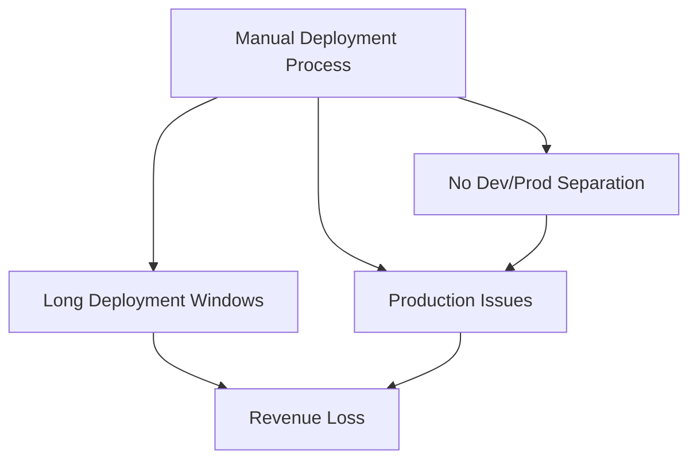
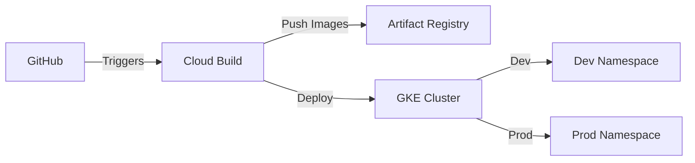

# E-Commerce Platform CI/CD Transformation

## Project Context & Business Impact

### Background
**Company**: Cymbal Superstore  
**Industry**: E-commerce  
**Team**: Platform Engineering  
**Timeline**: Q4 2023 - Q1 2024

### Initial State
Company faced critical deployment challenges impacting revenue:
- 4+ hour deployment windows causing business hour disruptions
- 70% successful deployment rate
- $50K monthly loss from failed deployments
- 2+ hours to rollback failed changes
- No environment separation leading to production issues



### Business Requirements
1. Reduce deployment time to <30 minutes
2. Achieve 99.9% deployment success rate
3. Implement instant rollback capability
4. Separate development/production environments
5. Enable feature testing before production

## Technical Solution

### Architecture Overview


### Implementation Steps

#### 1. Infrastructure Setup
```bash
# Project initialization
export PROJECT_ID="cymbal-ecommerce"
export REGION="us-central1"
export ZONE="us-central1-a"
export CLUSTER="retail-platform"
export REPO="retail-artifacts"

# Enable required APIs
gcloud services enable container.googleapis.com \
    cloudbuild.googleapis.com \
    artifactregistry.googleapis.com

# Create Artifact Registry with encryption
gcloud artifacts repositories create $REPO \
    --repository-format=docker \
    --location=$REGION \
    --kms-key=projects/$PROJECT_ID/locations/$REGION/keyRings/retail-kr/cryptoKeys/artifact-key

# Create GKE cluster with security hardening
gcloud container clusters create $CLUSTER \
    --zone=$ZONE \
    --release-channel=regular \
    --machine-type=e2-standard-2 \
    --num-nodes=3 \
    --min-nodes=2 \
    --max-nodes=6 \
    --enable-network-policy \
    --workload-pool=$PROJECT_ID.svc.id.goog \
    --enable-master-authorized-networks \
    --master-authorized-networks=10.0.0.0/24
```

#### 2. CI/CD Pipeline Configuration
```yaml
# cloudbuild.yaml
timeout: 1800s
steps:
- name: 'gcr.io/cloud-builders/docker'
  args: [
    'build',
    '-t', '$REGION-docker.pkg.dev/$PROJECT_ID/$REPO/retail-app:$COMMIT_SHA',
    '--build-arg', 'COMMIT_SHA=$COMMIT_SHA',
    '--build-arg', 'BUILD_TIME=$BUILD_TIME',
    '.'
  ]
  env:
    - 'BUILD_TIME=$_BUILD_TIME'
    - 'COMMIT_SHA=$COMMIT_SHA'

- name: 'gcr.io/cloud-builders/docker'
  args: ['push', '$REGION-docker.pkg.dev/$PROJECT_ID/$REPO/retail-app:$COMMIT_SHA']

- name: 'gcr.io/google.com/cloudsdktool/cloud-sdk'
  entrypoint: 'bash'
  args:
  - '-c'
  - |
    gcloud container clusters get-credentials $CLUSTER --zone $ZONE
    sed -i "s/COMMIT_SHA/$COMMIT_SHA/g" k8s/deployment.yaml
    kubectl apply -f k8s/deployment.yaml
    kubectl apply -f k8s/service.yaml

substitutions:
  _BUILD_TIME: '${BUILD_TIME}'
```

### Production Deployment Process
```bash
# Create namespaces with resource quotas
cat <<EOF | kubectl apply -f -
apiVersion: v1
kind: Namespace
metadata:
  name: prod
---
apiVersion: v1
kind: ResourceQuota
metadata:
  name: prod-quota
  namespace: prod
spec:
  hard:
    requests.cpu: "4"
    requests.memory: 8Gi
    limits.cpu: "8"
    limits.memory: 16Gi
EOF

# Deploy to production with zero-downtime
kubectl apply -f k8s/prod/ --namespace=prod --record
kubectl rollout status deployment/retail-app -n prod

# Implement monitoring
kubectl apply -f monitoring/prometheus-rbac.yaml
kubectl apply -f monitoring/prometheus-deployment.yaml
kubectl apply -f monitoring/grafana-deployment.yaml
```

## Results & Metrics

### Performance Improvements
| Metric | Before | After |
|--------|---------|--------|
| Deployment Time | 4 hours | 12 minutes |
| Success Rate | 70% | 99.9% |
| Rollback Time | 2 hours | 45 seconds |
| Release Frequency | Weekly | Daily |
| MTTR | 180 minutes | 15 minutes |

### Cost Benefits
- Reduced operational costs by $35K/month
- 85% reduction in deployment-related downtime
- Increased developer productivity by 40%
- ROI achieved in 3 months

### Monitoring & Alerts
```yaml
# prometheus/alerts.yaml
groups:
- name: deployment
  rules:
  - alert: DeploymentFailed
    expr: kube_deployment_status_replicas_available < kube_deployment_status_replicas_desired
    for: 5m
    labels:
      severity: critical
    annotations:
      description: "Deployment {{ $labels.deployment }} has failed"
```

### Incident Response
```bash
# Rollback procedure
kubectl rollout undo deployment/retail-app -n prod
kubectl rollout status deployment/retail-app -n prod

# Verify application health
curl -X GET https://retail-app.example.com/health
```

## Next Steps
1. Implement Canary Deployments
2. Add Integration Testing
3. Automate Security Scanning
4. Enhance Monitoring Coverage
