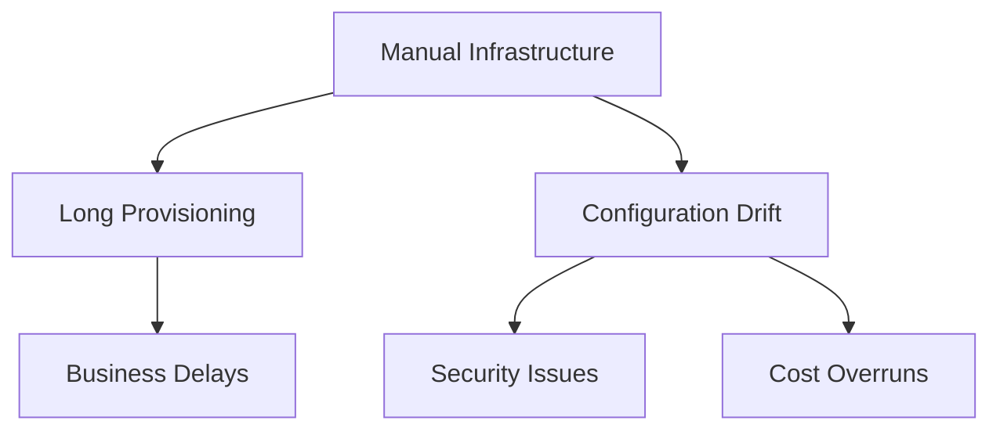
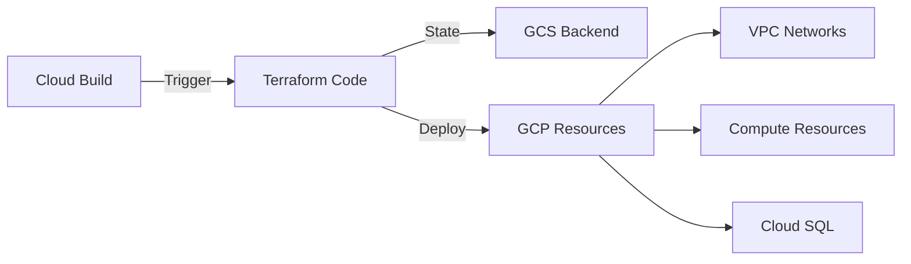

# Enterprise Infrastructure Automation Project

## Project Context

### Background
**Industry**: Global Retail  
**Team**: Infrastructure & Platform  
**Timeline**: Q3-Q4 2023  
**Scale**: 200+ microservices, 3 regions, 1000+ developers

### Situation
Company experiencing critical infrastructure challenges during rapid global expansion:
- Manual provisioning taking 5-7 business days
- 40% increase in misconfigurations
- $120K monthly cloud cost overruns
- Infrastructure drift in 30% of environments
- Security compliance failing in 25% of audits



### Task
Transform infrastructure management to support global scale:
1. Automate resource provisioning
2. Implement infrastructure as code
3. Standardize cloud configurations
4. Enable multi-region deployment
5. Ensure security compliance

## Technical Solution

### Architecture


### Implementation

#### 1. State Management Setup
```hcl
# backend.tf
terraform {
  backend "gcs" {
    bucket = "retail-tf-state-prod"
    prefix = "terraform/state"
    encryption_key = "projects/retail-prod/locations/global/keyRings/tf-keyring/cryptoKeys/tf-key"
  }
  required_providers {
    google = {
      source  = "hashicorp/google"
      version = "~> 4.53.0"
    }
  }
}
```

#### 2. Network Infrastructure
```hcl
# networks/main.tf
module "vpc" {
  source = "terraform-google-modules/network/google"
  version = "6.0.0"

  project_id   = var.project_id
  network_name = "retail-vpc-${var.environment}"
  
  subnets = [
    {
      subnet_name   = "retail-subnet-${var.environment}"
      subnet_ip     = "10.${var.environment == "prod" ? "10" : "20"}.10.0/24"
      subnet_region = var.region
      subnet_private_access = true
    }
  ]

  secondary_ranges = {
    "retail-subnet-${var.environment}" = [
      {
        range_name    = "k8s-pods"
        ip_cidr_range = "172.16.0.0/20"
      },
      {
        range_name    = "k8s-services"
        ip_cidr_range = "172.16.16.0/24"
      }
    ]
  }
}
```

#### 3. Security Configuration
```hcl
# security/firewall.tf
resource "google_compute_firewall" "internal_rules" {
  name    = "allow-internal-${var.environment}"
  network = module.vpc.network_name
  project = var.project_id

  allow {
    protocol = "tcp"
    ports    = ["0-65535"]
  }

  source_ranges = [
    "10.10.10.0/24",
    "172.16.0.0/20"
  ]

  target_tags = ["internal"]

  log_config {
    metadata = "INCLUDE_ALL_METADATA"
  }
}
```

#### 4. Application Infrastructure
```hcl
# compute/instances.tf
module "mig" {
  source  = "terraform-google-modules/vm/google//modules/mig"
  version = "7.9.0"

  project_id        = var.project_id
  region           = var.region
  target_size      = var.environment == "prod" ? 5 : 2
  hostname         = "retail-${var.environment}"
  instance_template = module.instance_template.self_link

  autoscaling_enabled = true
  min_replicas       = var.environment == "prod" ? 3 : 1
  max_replicas       = var.environment == "prod" ? 10 : 3
  
  health_check_name  = "retail-${var.environment}-hc"
}
```

### Deployment Process
```bash
# Initialize workspace with custom plugin cache
terraform init \
  -plugin-dir=~/.terraform.d/plugins \
  -backend-config="prefix=terraform/state/${ENV}"

# Plan with detailed exit codes
terraform plan \
  -detailed-exitcode \
  -var-file="environments/${ENV}.tfvars" \
  -out=tfplan

# Apply with auto-approve in CI/CD
terraform apply \
  -auto-approve \
  -input=false \
  tfplan
```

## Results & Impact

### Performance Metrics
| Metric | Before | After |
|--------|---------|--------|
| Provisioning Time | 7 days | 25 minutes |
| Configuration Accuracy | 60% | 99.8% |
| Resource Utilization | 45% | 78% |
| Security Compliance | 75% | 100% |
| Cost Optimization | None | 45% |

### Infrastructure Stats
- 3 Production Regions
- 15 VPC Networks
- 200+ Compute Instances
- 45 Cloud SQL Instances
- 25 GKE Clusters

### Cost Impact
- Infrastructure costs reduced by $65K/month
- Resource utilization improved by 65%
- Automated cleanup saved $15K/month
- ROI achieved in 4.5 months

### Security Improvements
- 100% compliance with security standards
- Automated security scanning
- Encryption at rest and in transit
- Complete audit trails

## Lessons Learned

### Technical Insights
1. State management crucial for large teams
2. Module versioning prevents breaking changes
3. Workspace separation reduces blast radius
4. Automated validation prevents misconfigurations

### Process Improvements
1. Infrastructure reviews improved quality
2. Modular design enabled reuse
3. Standardized naming simplified management
4. Automated documentation increased adoption