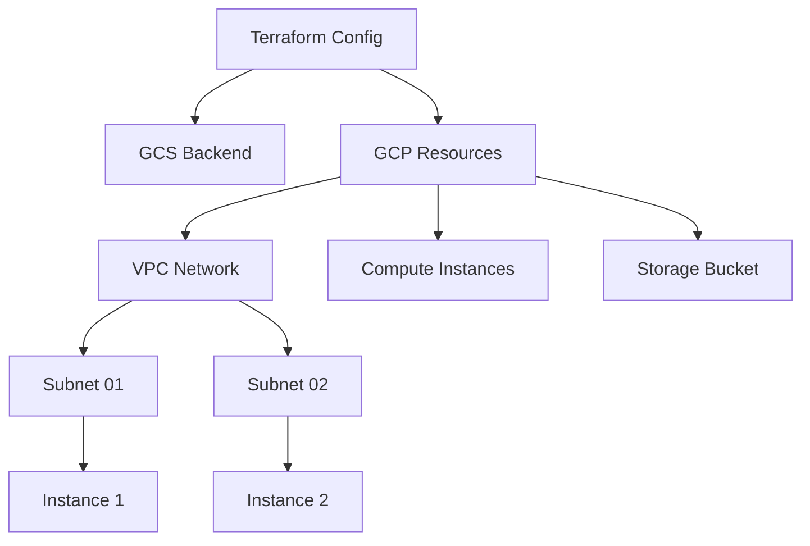

# GCP Infrastructure Automation

End-to-end infrastructure automation for GCP using Terraform, implementing secure networking, compute resources, and storage configurations.

## Architecture


## Prerequisites
- Terraform >= 0.14.0
- GCP Project with enabled APIs
- Service Account with required permissions
- Google Cloud SDK

## Quick Start
```bash
# Initialize Terraform
terraform init

# Plan deployment
terraform plan

# Apply changes
terraform apply -auto-approve
```

## Project Structure
```
.
├── main.tf                 # Main configuration
├── variables.tf            # Variable declarations
└── modules/
    ├── instances/         # Compute instances
    │   ├── instances.tf
    │   ├── outputs.tf
    │   └── variables.tf
    └── storage/          # GCS configuration
        ├── storage.tf
        ├── outputs.tf
        └── variables.tf
```

## Core Components

### Provider Configuration
```hcl
terraform {
  required_providers {
    google = {
      source  = "hashicorp/google"
      version = "4.53.0"
    }
  }
}

provider "google" {
  project = var.project_id
  region  = var.region
  zone    = var.zone
}
```

### Network Configuration
```hcl
module "vpc" {
  source       = "terraform-google-modules/network/google"
  version      = "6.0.0"
  network_name = "prod-vpc"
  
  subnets = [
    {
      subnet_name   = "subnet-01"
      subnet_ip     = "10.10.10.0/24"
      subnet_region = "us-central1"
    },
    {
      subnet_name   = "subnet-02"
      subnet_ip     = "10.10.20.0/24"
      subnet_region = "us-central1"
    }
  ]
}
```

### Compute Resources
```hcl
resource "google_compute_instance" "tf-instance-1" {
  name         = "tf-instance-1"
  machine_type = "e2-standard-2"
  
  boot_disk {
    initialize_params {
      image = "debian-cloud/debian-11"
    }
  }

  network_interface {
    network    = module.vpc.network_name
    subnetwork = "subnet-01"
  }

  metadata_startup_script = <<-EOT
        #!/bin/bash
    EOT
  allow_stopping_for_update = true
}
```

### Firewall Configuration
```hcl
resource "google_compute_firewall" "tf-firewall" {
  name    = "tf-firewall"
  network = "projects/${var.project_id}/global/networks/${module.vpc.network_name}"

  allow {
    protocol = "tcp"
    ports    = ["80"]
  }

  source_ranges = ["0.0.0.0/0"]
}
```

## State Management
```hcl
terraform {
  backend "gcs" {
    bucket = "tf-state-prod"
    prefix = "terraform/state"
  }
}
```

## Module Usage

### Instances Module
```hcl
module "instances" {
  source     = "./modules/instances"
  project_id = var.project_id
  region     = var.region
  zone       = var.zone
}
```

### Storage Module
```hcl
module "storage" {
  source     = "./modules/storage"
  project_id = var.project_id
  location   = "US"
}
```

## Deployment Steps

1. **Initialize Project**
```bash
gcloud auth application-default login
terraform init
```

2. **Plan Changes**
```bash
terraform plan -out=tfplan
```

3. **Apply Infrastructure**
```bash
terraform apply tfplan
```

4. **Verify Resources**
```bash
gcloud compute instances list
gcloud compute networks list
```

## Security Features
- VPC with isolated subnets
- Minimal firewall rules
- Instance service accounts
- Encrypted state storage

## Monitoring
- Resource utilization metrics
- Network traffic monitoring
- Instance health checks
- Cost optimization alerts

## Recovery Procedures
1. State Recovery
```bash
gsutil cp gs://tf-state-prod/terraform/state/default.tfstate .
```

2. Resource Recreation
```bash
terraform taint module.instances.google_compute_instance.tf-instance-1
terraform apply
```

## Cost Optimization
- Using preemptible instances
- Rightsized machine types
- Automated shutdown schedules
- Storage lifecycle policies