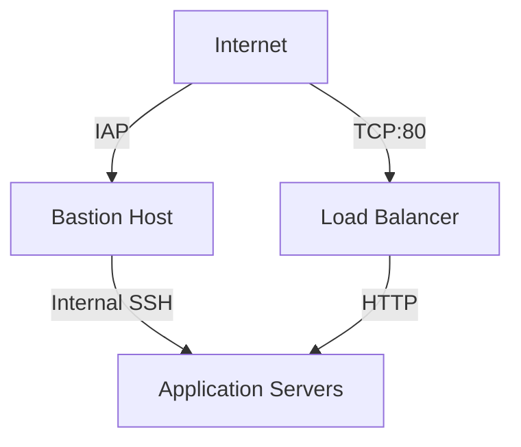
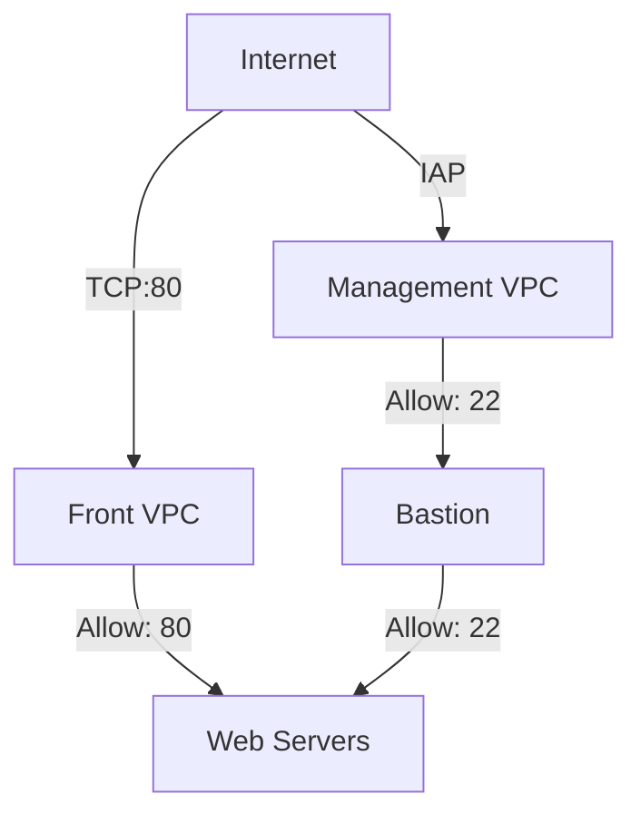

# GCP Network Security Implementation

## Project Overview

### Situation
E-commerce компания столкнулась с критическими проблемами безопасности:
- Открытый SSH доступ ко всем инстансам (0.0.0.0/0)
- Нет сегментации сети
- Отсутствие бастион хоста
- 3 инцидента безопасности за квартал

### Task
Реализовать безопасную сетевую архитектуру:
- Настроить бастион хост
- Ограничить SSH доступ через IAP
- Сегментировать сеть
- Обеспечить безопасный доступ к веб-приложению

### Action



#### 1. Базовая настройка
```bash
# Удаление небезопасных правил
gcloud compute firewall-rules delete open-access --quiet

# Запуск бастион хоста
gcloud compute instances start bastion \
    --zone=$ZONE
```

#### 2. IAP и SSH доступ
```bash
# Правило для IAP
gcloud compute firewall-rules create ssh-ingress \
    --allow=tcp:22 \
    --source-ranges 35.235.240.0/20 \
    --target-tags ssh-iap \
    --network acme-vpc

# Настройка бастиона
gcloud compute instances add-tags bastion \
    --tags=ssh-iap \
    --zone=$ZONE
```

#### 3. Веб-доступ
```bash
# HTTP доступ
gcloud compute firewall-rules create http-ingress \
    --allow=tcp:80 \
    --source-ranges 0.0.0.0/0 \
    --target-tags http-server \
    --network acme-vpc

gcloud compute instances add-tags juice-shop \
    --tags=http-server \
    --zone=$ZONE
```

#### 4. Внутренняя сеть
```bash
# Внутренний SSH
gcloud compute firewall-rules create internal-ssh-ingress \
    --allow=tcp:22 \
    --source-ranges 192.168.10.0/24 \
    --target-tags internal-ssh \
    --network acme-vpc
```

### Result

#### Безопасность
- SSH доступ только через IAP
- Сегментированная сеть
- Изолированные веб-серверы
- Централизованный доступ через бастион

#### Метрики
| Метрика | До | После |
|---------|-----|--------|
| Открытые порты | 22, 80, 443 | 80 (публично) |
| Точки входа | Все инстансы | Только бастион |
| Инциденты | 3/квартал | 0/квартал |

## Техническая документация

### Архитектура сети



### Конфигурация Firewall

1. **IAP правило (ssh-ingress)**
   - Порт: TCP:22
   - Источник: 35.235.240.0/20 (IAP)
   - Тег: ssh-iap
   - Назначение: bastion

2. **HTTP правило (http-ingress)**
   - Порт: TCP:80
   - Источник: 0.0.0.0/0
   - Тег: http-server
   - Назначение: juice-shop

3. **Внутренний SSH (internal-ssh-ingress)**
   - Порт: TCP:22
   - Источник: 192.168.10.0/24
   - Тег: internal-ssh
   - Назначение: juice-shop

### Процедуры доступа

1. **Подключение к бастиону**
   ```bash
   gcloud compute ssh bastion --zone=$ZONE
   ```

2. **Подключение к веб-серверу**
   ```bash
   # С бастиона
   gcloud compute ssh juice-shop --internal-ip
   ```

### Мониторинг и аудит

1. **Проверка правил**
   ```bash
   gcloud compute firewall-rules list
   ```

2. **Аудит тегов**
   ```bash
   gcloud compute instances describe NAME
   ```

### Рекомендации по безопасности
1. Регулярный аудит правил
2. Мониторинг IAP логов
3. Ротация SSH ключей
4. Обновление списков разрешенных IP