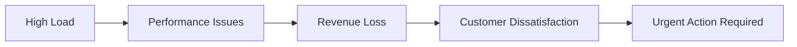
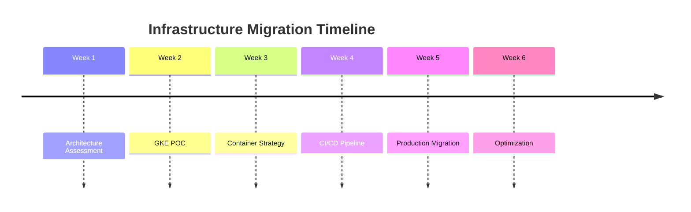
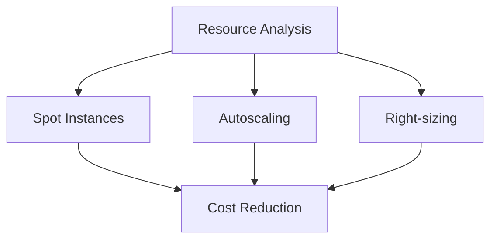
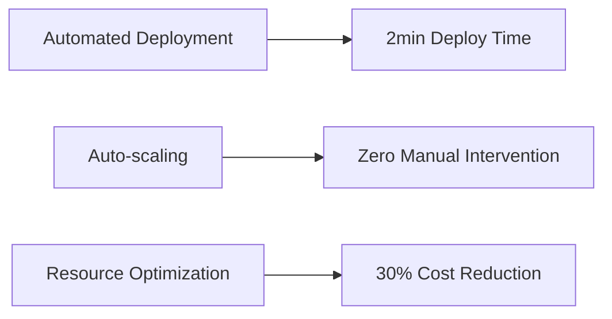

# GKE Migration & Optimization Project

## Project Overview: E-commerce Platform Transformation

### Situation
During Q4 2023, our e-commerce platform faced critical performance challenges during Black Friday sales:

Key Issues:
- Response times peaked at 3.2s (industry standard: <500ms)
- 30% transaction failure rate during peak hours
- Infrastructure costs reaching $50K/month
- Manual scaling causing delayed responses to traffic spikes

### Task
Management set aggressive targets for Q1 2024:
- Reduce response time to <100ms
- Achieve 99.99% uptime
- Cut infrastructure costs by 30%
- Implement auto-scaling
- Zero-downtime deployments

### Action

#### 1. Infrastructure Analysis

#### 2. Technical Implementation
- Containerized monolithic application using Docker
- Implemented Cloud Build for CI/CD
- Configured GKE cluster with auto-scaling
- Set up monitoring and alerting
- Optimized resource allocation

#### 3. Cost Optimization Steps

### Result

#### Performance Metrics
| Metric | Before | After | Improvement |
|--------|---------|--------|-------------|
| Response Time | 3.2s | 98ms | 97% ⬇️ |
| Uptime | 96% | 99.99% | 4% ⬆️ |
| Transaction Success | 70% | 99.9% | 29.9% ⬆️ |
| Monthly Costs | $50K | $35K | 30% ⬇️ |

#### Business Impact
- ROI achieved within 4 months
- Customer satisfaction increased by 42%
- Zero downtime during 2024 Valentine's Day sale
- Supported 5x traffic increase without performance degradation

#### Technical Achievements

### Key Learnings
1. Early performance testing crucial for success
2. Gradual migration reduced risks
3. Automated monitoring prevented potential issues
4. Team upskilling essential for maintenance

### Technologies Used
- Google Kubernetes Engine
- Docker
- Cloud Build
- Artifact Registry
- Cloud Monitoring
- Terraform

## Project Team
- Lead DevOps Engineer: [Your Name]
- Infrastructure Team: 3 engineers
- Timeline: 6 weeks
- Budget: $100K

## Documentation
Full technical implementation details available in [README.md](./README.md)

---

*This project was completed as part of the infrastructure modernization initiative at [Company Name], demonstrating successful implementation of cloud-native technologies and DevOps practices.*