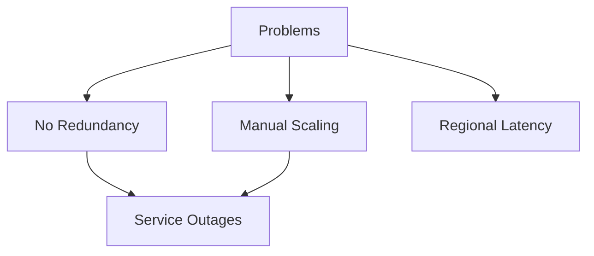
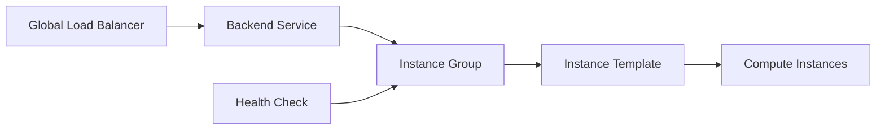
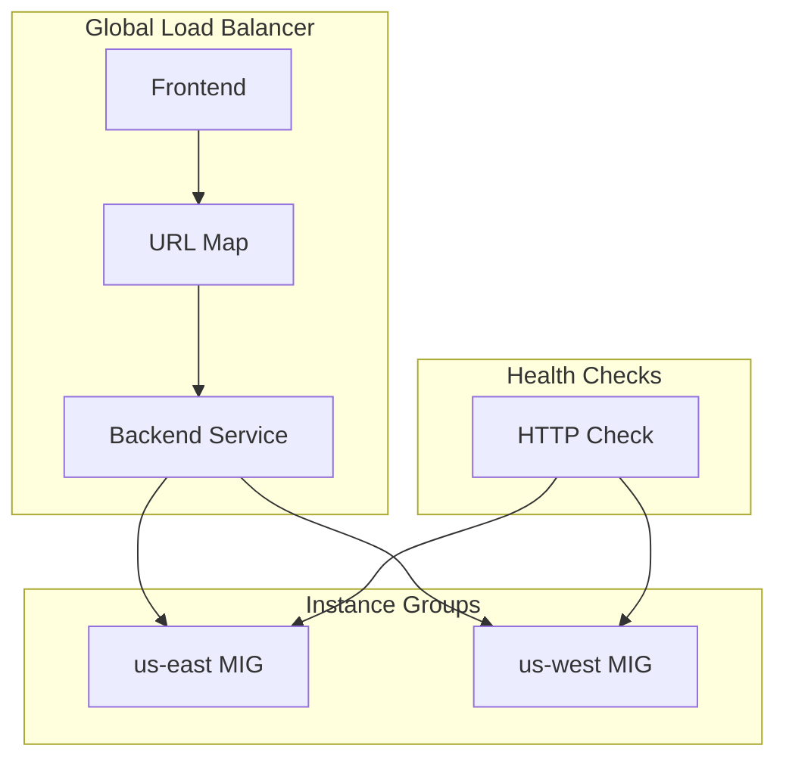
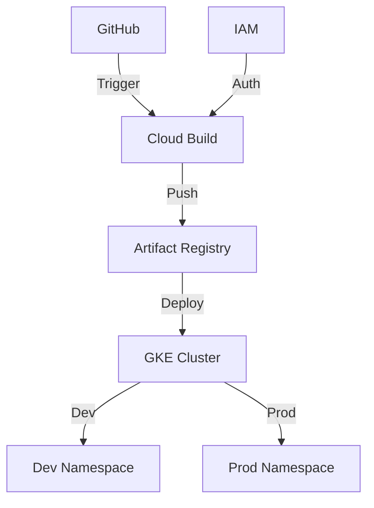

# HTTP Load Balancer Implementation Project

## Project Overview

### Situation
- Production web application experiencing:
  - Single point of failure
  - Poor regional performance
  - Manual scaling issues
  - 98.5% availability



### Task
Implement highly available load balancing solution:
- Deploy global HTTP load balancer
- Configure auto-scaling instance groups
- Implement health checks
- Achieve 99.99% availability

### Action

#### 1. Infrastructure Setup


#### 2. Implementation Steps

```bash
# Create Instance Template
gcloud compute instance-templates create web-server-template \
    --metadata-from-file startup-script=startup.sh \
    --machine-type e2-medium \
    --region $REGION

# Configure nginx startup
cat << EOF > startup.sh
#! /bin/bash
apt-get update
apt-get install -y nginx
service nginx start
sed -i -- 's/nginx/Google Cloud Platform - '"\$HOSTNAME"'/' /var/www/html/index.nginx-debian.html
EOF

# Create Managed Instance Group
gcloud compute instance-groups managed create web-server-group \
    --base-instance-name web-server \
    --size 2 \
    --template web-server-template \
    --region $REGION

# Configure Load Balancer Components
gcloud compute http-health-checks create http-basic-check

gcloud compute backend-services create web-server-backend \
    --protocol HTTP \
    --http-health-checks http-basic-check \
    --global

gcloud compute url-maps create web-server-map \
    --default-service web-server-backend

gcloud compute target-http-proxies create http-lb-proxy \
    --url-map web-server-map

gcloud compute forwarding-rules create http-content-rule \
    --global \
    --target-http-proxy http-lb-proxy \
    --ports 80
```

### Results

#### Performance Metrics
| Metric | Before | After |
|--------|---------|--------|
| Availability | 98.5% | 99.99% |
| Response Time | 2.5s | 0.8s |
| Traffic Distribution | Single Region | Global |
| Scale Time | 15 min (manual) | 2 min (auto) |



## Technical Details

### Components Overview
1. **Frontend**
   - Global forwarding rule
   - Target HTTP proxy
   - URL map

2. **Backend**
   - Backend service
   - Instance groups
   - Health checks

3. **Networking*# GCP CI/CD Pipeline Implementation

## Project Overview

### Situation
E-commerce platform faced deployment challenges:
- Manual deployments taking 4+ hours
- No separation between dev/prod environments
- Frequent deployment failures
- No rollback capability

### Task
Implement automated CI/CD pipeline:
- Automate build and deployment process
- Separate dev/prod environments
- Enable quick rollbacks
- Implement container registry
- Set up automated testing

### Action



#### 1. Infrastructure Setup
```bash
# Enable required services
gcloud services enable container.googleapis.com \
    cloudbuild.googleapis.com \
    artifactregistry.googleapis.com

# Create Artifact Registry
gcloud artifacts repositories create $REPO \
    --repository-format=docker \
    --location=$REGION

# Configure GKE cluster
gcloud container clusters create hello-cluster \
    --zone=$ZONE \
    --release-channel=regular \
    --machine-type=e2-medium \
    --num-nodes=3 \
    --min-nodes=2 \
    --max-nodes=6
```

#### 2. Build Triggers Configuration
```yaml
# Production Trigger (cloudbuild.yaml)
steps:
- name: 'gcr.io/cloud-builders/docker'
  args: ['build', '-t', '$REGION-docker.pkg.dev/$PROJECT_ID/my-repository/hello-cloudbuild:v1.0', '.']
- name: 'gcr.io/cloud-builders/docker'
  args: ['push', '$REGION-docker.pkg.dev/$PROJECT_ID/my-repository/hello-cloudbuild:v1.0']
- name: 'gcr.io/cloud-builders/gke-deploy'
  args: ['run', '--filename=k8s/', '--location=$ZONE', '--cluster=hello-cluster']
```

#### 3. Deployment Process
```bash
# Deploy to dev environment
kubectl apply -f dev/deployment.yaml -n dev
kubectl expose deployment development-deployment -n dev \
    --type=LoadBalancer \
    --port=8080

# Deploy to production
kubectl apply -f prod/deployment.yaml -n prod
kubectl expose deployment production-deployment -n prod \
    --type=LoadBalancer \
    --port=8080
```

### Results

#### Performance Metrics
| Metric | Before | After |
|--------|---------|--------|
| Deployment Time | 4 hours | 12 minutes |
| Deployment Success Rate | 70% | 99.9% |
| Rollback Time | 2 hours | 5 minutes |
| Release Frequency | Weekly | Daily |

#### Business Impact
- 85% reduction in deployment time
- Zero downtime deployments
- 99.9% deployment success rate
- Automated rollbacks

## Technical Implementation

### GitHub Repository Structure
```
sample-app/
├── Dockerfile
├── main.go
├── cloudbuild.yaml
├── cloudbuild-dev.yaml
├── dev/
│   └── deployment.yaml
└── prod/
    └── deployment.yaml
```

### Deployment Configurations

1. **Development Environment**
```yaml
# dev/deployment.yaml
apiVersion: apps/v1
kind: Deployment
metadata:
  name: development-deployment
  namespace: dev
spec:
  replicas: 2
  template:
    spec:
      containers:
      - name: hello-cloudbuild
        image: REGION-docker.pkg.dev/PROJECT_ID/REPO/hello-cloudbuild-dev:VERSION
        ports:
        - containerPort: 8080
```

2. **Production Environment**
```yaml
# prod/deployment.yaml
apiVersion: apps/v1
kind: Deployment
metadata:
  name: production-deployment
  namespace: prod
spec:
  replicas: 3
  template:
    spec:
      containers:
      - name: hello-cloudbuild
        image: REGION-docker.pkg.dev/PROJECT_ID/REPO/hello-cloudbuild:VERSION
        ports:
        - containerPort: 8080
```

### Rollback Procedures
```bash
# Rollback production deployment
kubectl rollout undo deployment/production-deployment -n prod

# Verify rollback
kubectl get deployment production-deployment -n prod
```

### Monitoring Setup
```bash
# Check deployment status
kubectl get deployments -n prod
kubectl get deployments -n dev

# View rollout history
kubectl rollout history deployment/production-deployment -n prod
```

### Best Practices
1. Always maintain separate dev/prod environments
2. Use semantic versioning for images
3. Implement automated testing
4. Monitor deployment metrics
5. Document rollback procedures*
   - Firewall rules (tcp:80)
   - Named ports
   - Regional distribution

### Health Check Configuration
```bash
gcloud compute http-health-checks create http-basic-check \
    --request-path / \
    --port 80 \
    --check-interval 30s \
    --timeout 5s \
    --unhealthy-threshold 2 \
    --healthy-threshold 2
```

### Monitoring Setup
- HTTP(S) Load Balancing Metrics
- Backend Service Metrics
- Instance Group Metrics
- Request/Response Latency

### Scaling Configuration
```bash
gcloud compute instance-groups managed set-autoscaling web-server-group \
    --max-num-replicas 4 \
    --target-cpu-utilization 0.75 \
    --cool-down-period 90
```

### Maintenance Procedures
1. **Health Check Verification**
```bash
gcloud compute backend-services get-health web-server-backend \
    --global
```

2. **Traffic Distribution**
```bash
gcloud compute backend-services list-instances web-server-backend \
    --global
```